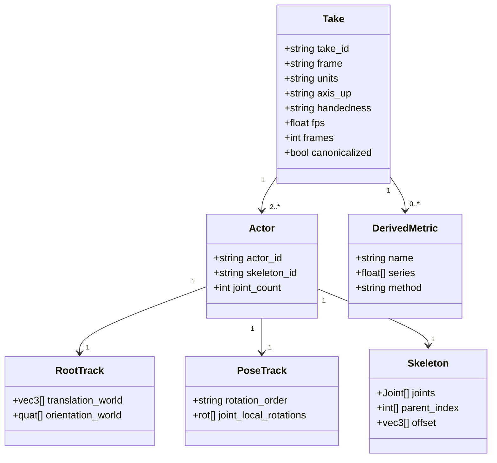

# Shared-Frame Multi-Actor Motion Capture — a delivery specification

**Version:** 0.1 draft · 2026-08-03
**Status:** draft, published for comment. Vendor-neutral; issues and pull
requests welcome.

A buyer of multi-actor motion capture can hand this to any vendor and get an
unambiguous answer about whether the data will support inter-actor modelling.
Nothing here is specific to one supplier, and §7 is deliberately written so a
buyer can fail *us* with it.

---

## 1. The problem this exists to solve

Most released motion datasets are distributed in a **per-actor canonical frame**:
each actor's root translated to the origin and rotated to a fixed heading,
because that is what single-actor text-to-motion models want.

That transform is lossy in a specific and fatal way. **It destroys the relative
translation between actors.** Two people can be captured in one calibrated
volume, genuinely sharing a frame, and still be delivered as two independently
origin-centred sequences from which contact, distance and relative pose can never
be recovered.

The loss is silent. Both files load, both animate, both look correct in isolation.
The damage is only visible when you ask a question that spans the two actors —
by which point the capture is finished and the volume is gone.

**Canonicalization is a derived view, not a storage format.** It can always be
computed from shared-frame data; shared-frame data can never be recovered from
it.

## 2. Scope and terms

- **Capture-volume frame** — a single, static, right-handed coordinate system
  fixed to the capture space, shared by every actor in a take.
- **Actor root** — the root joint of one actor's skeleton, carrying that actor's
  position and orientation *in the capture-volume frame*.
- **Canonicalization** — any per-actor transform that re-origins or re-orients
  that actor's root independently of the others.
- **Take** — one continuous recording containing ≥2 actors.

This spec covers **delivery representation only**. It does not prescribe capture
technology, skeleton topology, or file format.

## 3. Conformance levels

Vendors should state a level. Buyers should require one.

### Level 0 — Canonicalized *(not conformant)*
Per-actor origin-centred motion. Inter-actor geometry is unrecoverable. Adequate
for single-actor generative modelling; unusable for interaction.

### Level 1 — Shared frame
- All actors' root translation **and** orientation are expressed in one
  capture-volume frame.
- Actors are **frame-synchronized**: sample *i* of every actor file is the same
  instant.
- Units and axis convention are declared explicitly (§4).

### Level 2 — Shared frame, independently verifiable
Level 1, plus:
- Calibration and units are published, not implied.
- The delivery includes at least one **derived inter-actor measurement** the
  buyer can recompute from the raw files and check for agreement (§7).

Level 2 exists because Level 1 is unfalsifiable from the outside on a short
sample. A buyer who cannot verify is trusting a claim.

## 4. Required declarations

Every delivery must state, in machine-readable form:

| Field | Meaning |
|---|---|
| `frame` | identifier of the shared capture-volume frame |
| `units` | length unit, explicitly (`metres`, `centimetres`, …) |
| `axis_up` / `axis_forward` | axis convention, e.g. `Y-up`, `Z-forward` |
| `handedness` | `right` or `left` |
| `fps` | sample rate |
| `frames` | sample count, identical across actors in a take |
| `actors[]` | one entry per actor: id, skeleton topology, joint count |
| `root_channels` | which channels carry global translation and rotation |
| `canonicalized` | **must be `false`** for Level 1+ |

Implicit units are a common and expensive failure. "It's obviously metres" is not
a declaration.

## 5. Data model



`RootTrack.translation_world` is the field this entire spec is about. If it is
zero-centred per actor, the delivery is Level 0 regardless of what else is true.

## 6. The canonicalization boundary

Canonicalization is permitted **only** as an explicitly-labelled derived product
delivered *alongside* the shared-frame source — never as a replacement.

```
    shared-frame source   ──(lossy, one-way)──▶   canonicalized view
    (must be delivered)                            (optional convenience)
```

A vendor offering only the right-hand side is Level 0, whatever the capture rig
was capable of.

## 7. Verification — how a buyer checks the claim

Run these on a sample **before** purchase. They are cheap and they are decisive.

**7.1 Root separation is non-degenerate.**
Compute the distance between actor roots at every frame. If it is identically
zero, near-constant, or each actor's root hovers about the origin, the data was
canonicalized. Genuine dyadic capture produces a varying separation on the scale
of the interaction.

**7.2 Closest approach is physically plausible.**
Run forward kinematics on both skeletons and compute the minimum pairwise joint
distance per frame. For contact interaction, expect values reaching the
centimetre scale. A floor of tens of centimetres means the actors were never
actually in contact — or were re-origined.

**7.3 Scale is real.**
Measure a known segment (femur, humerus) from the skeleton offsets. A human femur
is ~0.4–0.5 m. If it isn't, the declared units are wrong.

**7.4 Synchronization holds.**
Confirm identical frame counts and that a shared event (a contact, an impact)
lands on the same index in both actors' tracks.

**7.5 Recompute the vendor's derived metric.**
For Level 2, independently recompute at least one published inter-actor value
from the raw files. Disagreement means the metric was not derived from the data
you were given.

> **Note on rotational metrics.** Do **not** evaluate joint range of motion from
> per-axis Euler ranges. Euler representations pass through gimbal singularities:
> a joint can pin one axis at 0–180° while the other two swing the full ±180°,
> producing an apparent ~900° "range" on a human spine. Unwrapping makes it worse
> by accumulating flips. Compute angular quantities geodesically from rotation
> matrices — `θ = arccos((tr(AᵀB) − 1) / 2)` — which has no singularity. This
> applies to any consumer of this spec, not just to verification.

## 8. Capture-side recommendations

Not required for conformance, but they make Level 2 cheap instead of impossible:

- A single calibrated volume with one published origin.
- A synchronized T-pose and range-of-motion pass for **every** actor at the head
  of each take, in-frame together. This makes the skeletons trivially
  co-registerable downstream; reconstructing it later is expensive or impossible.
- Preserve raw marker data or C3D alongside any processed export.

## 9. Worked example

A spec of this kind is easier to apply against something concrete, so one
conforming delivery is described here for reference.

RTK Motion publishes Level 2 two-actor capture: 60 fps, 56 joints per actor, in a
shared metric capture-volume frame, with per-take inter-actor measurements
(closest approach, mean separation, proportion of frames in contact, and a
separation time series) recomputable from the source files.

Readers are encouraged to run §7 against it, 7.5 included. The verification
procedure is only worth anything if it is actually exercised, and a worked
example that cannot survive it would not be worth citing.

## 10. Scope of v0.1, and candidate extensions

The following are **deliberate scoping decisions for v0.1**, not unresolved gaps.
Input on any of them is welcome.

**Rotation representation is intentionally not constrained.** Level 1 requires
that root orientation be expressed in the shared frame and that the convention be
declared — not that any particular representation be used. Euler, quaternion and
matrix forms are all conforming. The pathology described in §7 is a property of
how angular quantities are *computed*, not of how they are *stored*, and the
geodesic requirement addresses it for every representation. Constraining storage
would exclude conforming data (BVH among it) without improving correctness.

**Single capture volume.** v0.1 addresses one static shared frame, which covers
the dominant case for dyadic interaction capture. Multi-volume, moving-rig and
outdoor captures would need a defined frame hierarchy with explicit parent
transforms; that is a candidate for a later revision rather than something v0.1
leaves ambiguous — a single declared frame is unambiguous within its scope.

**Declaration form.** `canonicalized: false` is required rather than a positive
`shared_frame: true`, deliberately: the negative form forces a vendor to make an
explicit assertion about the specific transform that causes the loss, and is
harder to satisfy by accident.

Candidate extensions for a future revision: contact and force annotation,
marker-level or C3D delivery alongside processed skeletons, and conformance
profiles for >2 actors.

---

Comments, corrections and conformance reports are welcome via issues on this
repository.
